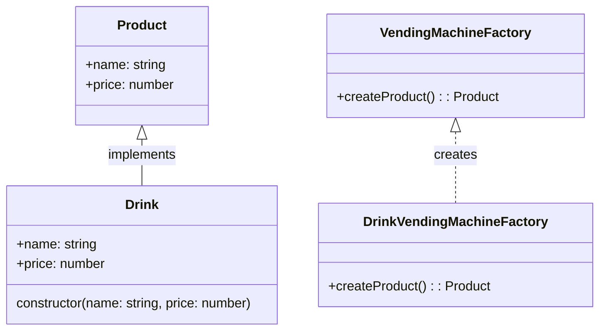
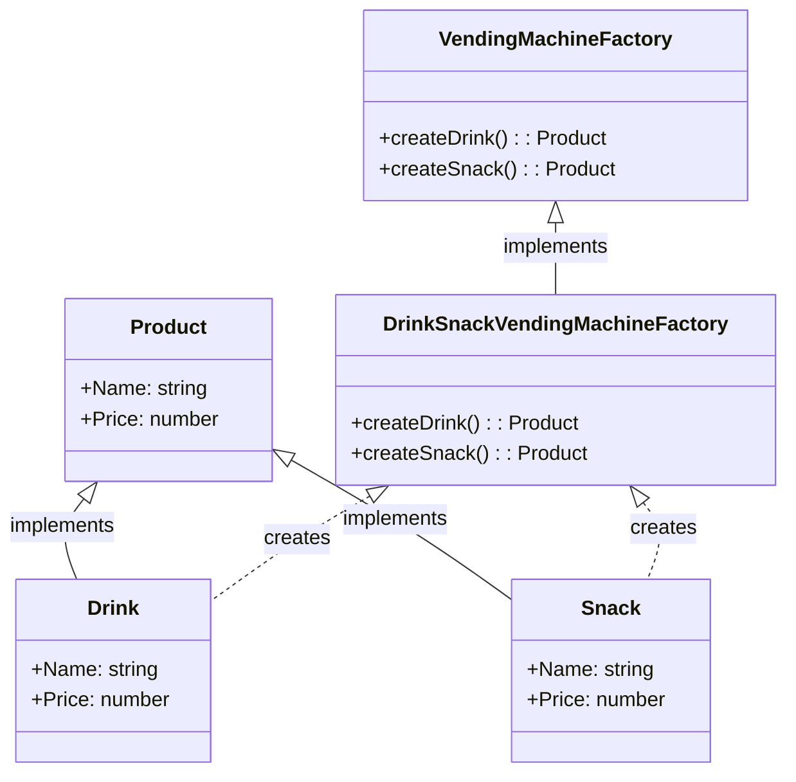
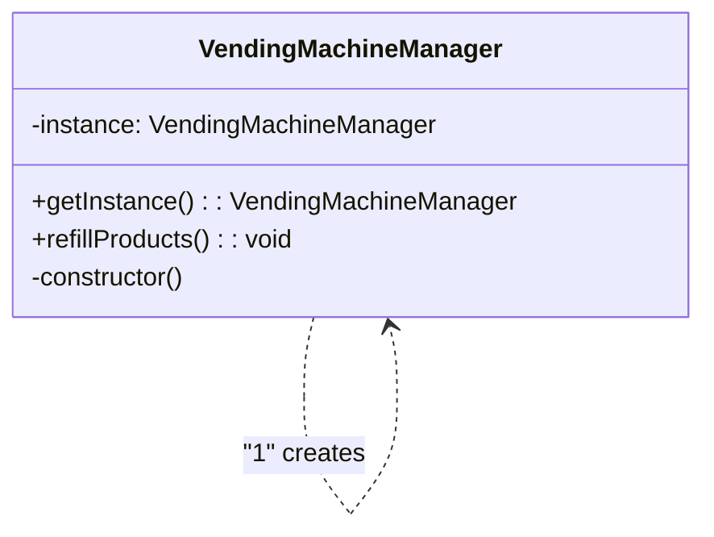
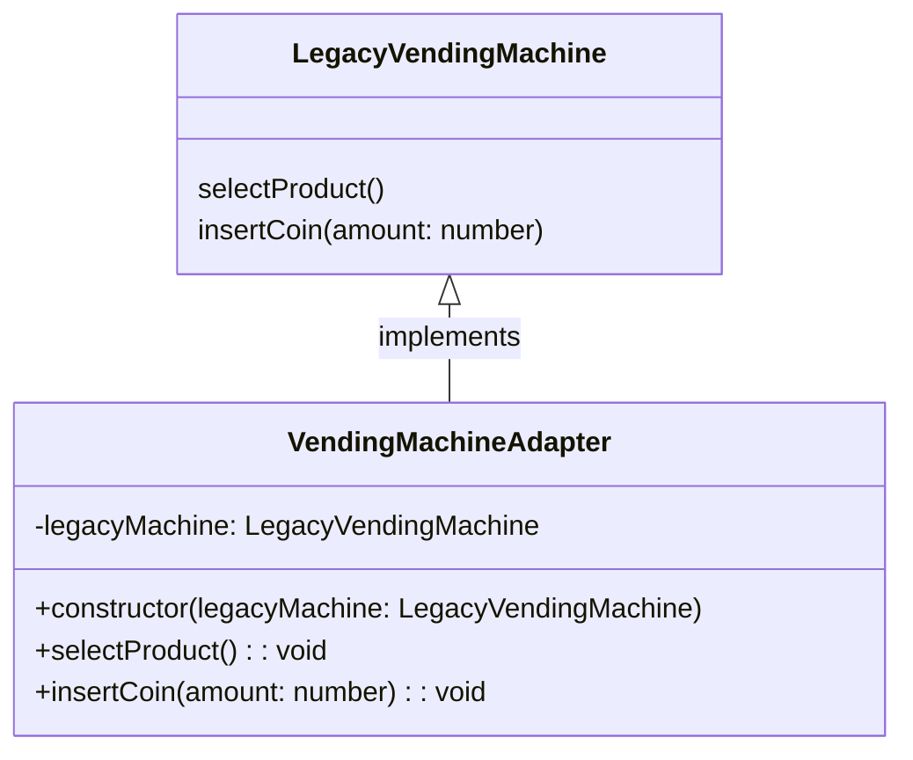
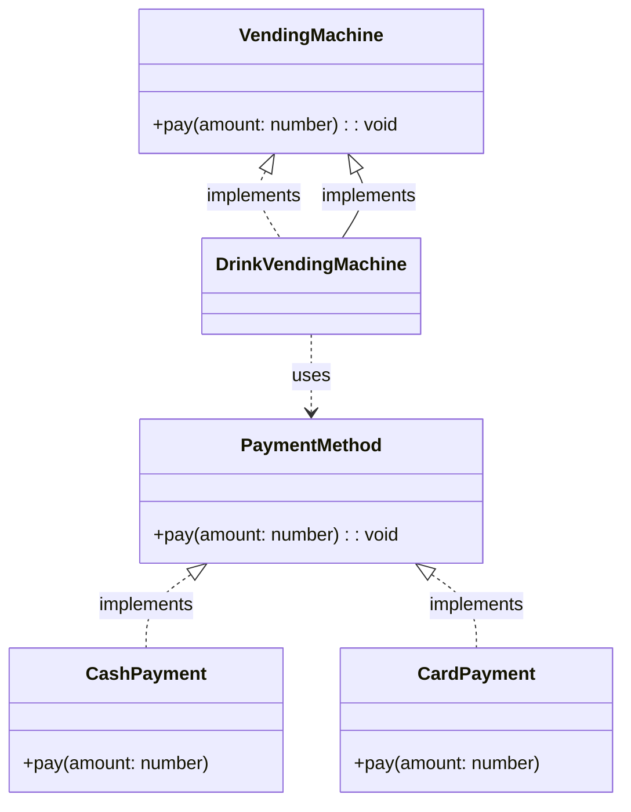

# Шаблоны проектирования

**Порождающие шаблоны**

### Фабричный метод
Фабричный метод - это шаблон проектирования, который помогает создавать объекты, не привязываясь к конкретным классам этих объектов.

_Схема_



**Код**

```typescript
// Интерфейс продукта
interface Product {
    Name: string;
    Price: number;
}

// Класс конкретного продукта
class Drink implements Product {
    constructor(public Name: string, public Price: number) {}
}

// Фабричный метод для создания продуктов
abstract class VendingMachineFactory {
    abstract createProduct(): Product;
}

// Конкретная фабрика для создания напитков
class DrinkVendingMachineFactory extends VendingMachineFactory {
    createProduct(): Product {
        return new Drink("Cola", 1.5);
    }
}

const drinkFactory = new DrinkVendingMachineFactory();
const product = drinkFactory.createProduct();
console.log(product);

```

### Абстрактная фабрика

Абстрактная фабрика - это способ организации создания связанных объектов без необходимости знать о конкретных классах этих объектов.

_Схема_



**Код**

```typescript
// Абстрактный класс продукта
abstract class Product {
    abstract Name: string;
    abstract Price: number;
}

// Конкретные продукты
class Drink extends Product {
    Name = "Cola";
    Price = 1.5;
}

class Snack extends Product {
    Name = "Chips";
    Price = 2;
}

// Абстрактная фабрика
abstract class VendingMachineFactory {
    abstract createDrink(): Product;
    abstract createSnack(): Product;
}

// Конкретная фабрика для создания напитков и закусок
class DrinkSnackVendingMachineFactory extends VendingMachineFactory {
    createDrink(): Product {
        return new Drink();
    }

    createSnack(): Product {
        return new Snack();
    }
}

const machineFactory = new DrinkSnackVendingMachineFactory();
const drink = machineFactory.createDrink();
const snack = machineFactory.createSnack();
console.log(drink); 
console.log(snack); 
```

### Одиночка

Одиночка - это способ создания класса таким образом, чтобы он имел только один экземпляр и предоставлял глобальную точку доступа к этому экземпляру.

_Схема_



**Код**

```typescript
// Класс управления вендинговыми автоматами (Одиночка)
class VendingMachineManager {
    private static instance: VendingMachineManager;

    private constructor() {}

    static getInstance(): VendingMachineManager {
        if (!VendingMachineManager.instance) {
            VendingMachineManager.instance = new VendingMachineManager();
        }
        return VendingMachineManager.instance;
    }

    // Другие методы для управления вендинговыми автоматами
    refillProducts() {
        console.log("Refilling products...");
    }
}

const manager1 = VendingMachineManager.getInstance();
const manager2 = VendingMachineManager.getInstance();

console.log(manager1 === manager2); 
manager1.refillProducts(); 
```


**Структурные шаблоны**


### Адаптер

Адаптер - паттерн проектирования, который позволяет объектам с несовместимыми интерфейсами работать вместе.

_Схема_



**Код**

```typescript
// Интерфейс внешней библиотеки
interface ExternalVendingMachine {
    selectProduct(): void;
    insertCoin(amount: number): void;
}

// Класс внешней библиотеки
class LegacyVendingMachine implements ExternalVendingMachine {
    selectProduct() {
        console.log("Selecting product...");
    }

    insertCoin(amount: number) {
        console.log(`Inserting ${amount} coins...`);
    }
}


class VendingMachineAdapter implements VendingMachine {
    private legacyMachine: LegacyVendingMachine;

    constructor(legacyMachine: LegacyVendingMachine) {
        this.legacyMachine = legacyMachine;
    }

    selectProduct() {
        this.legacyMachine.selectProduct();
    }

    insertCoin(amount: number) {
        this.legacyMachine.insertCoin(amount);
    }
}

const legacyMachine = new LegacyVendingMachine();
const adapter = new VendingMachineAdapter(legacyMachine);
adapter.selectProduct();
adapter.insertCoin(1.5);
```

### Мост

Мост - структурный шаблон проектирования, который позволяет отделить абстракцию от реализации таким образом, чтобы они могли изменяться независимо друг от друга.

_Схема_



**Код**

```typescript
// Абстракция
interface VendingMachine {
    pay(amount: number): void;
}

// Реализация
interface PaymentMethod {
    pay(amount: number): void;
}

// Конкретная реализация - наличные
class CashPayment implements PaymentMethod {
    pay(amount: number) {
        console.log(`Paying ${amount} with cash...`);
    }
}

// Конкретная реализация - карта
class CardPayment implements PaymentMethod {
    pay(amount: number) {
        console.log(`Paying ${amount} with card...`);
    }
}

// Абстрактный класс автомата
abstract class VendingMachine {
    protected paymentMethod: PaymentMethod;

    constructor(paymentMethod: PaymentMethod) {
        this.paymentMethod = paymentMethod;
    }

    abstract pay(amount: number): void;
}

// Конкретная реализация автомата
class DrinkVendingMachine extends VendingMachine {
    pay(amount: number) {
        this.paymentMethod.pay(amount);
    }
}

const cashPayment = new CashPayment();
const cardPayment = new CardPayment();

const vendingMachine1 = new DrinkVendingMachine(cashPayment);
const vendingMachine2 = new DrinkVendingMachine(cardPayment);

vendingMachine1.pay(1.5);
vendingMachine2.pay(1.5);
```
